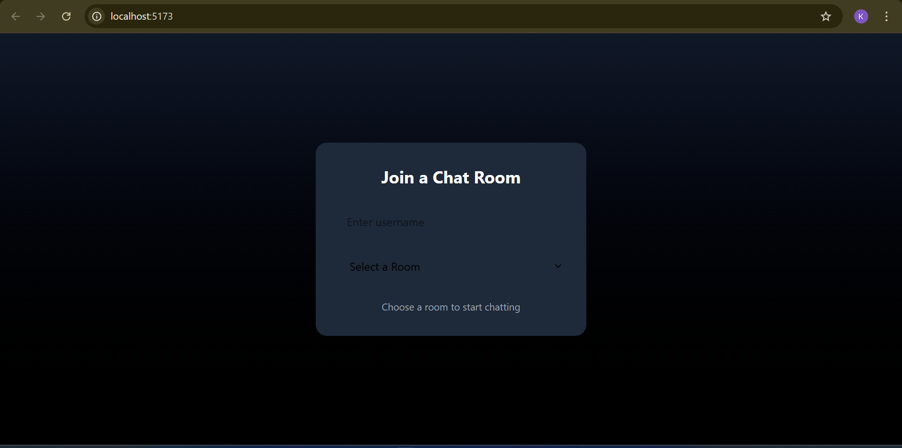
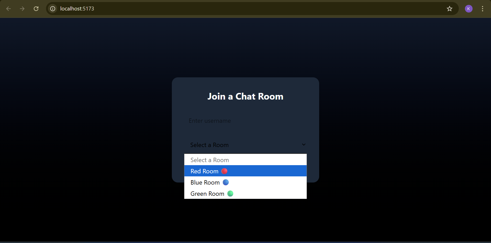
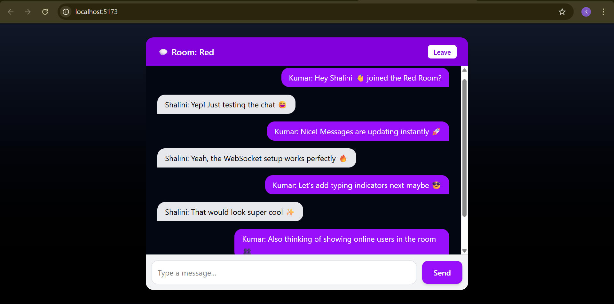
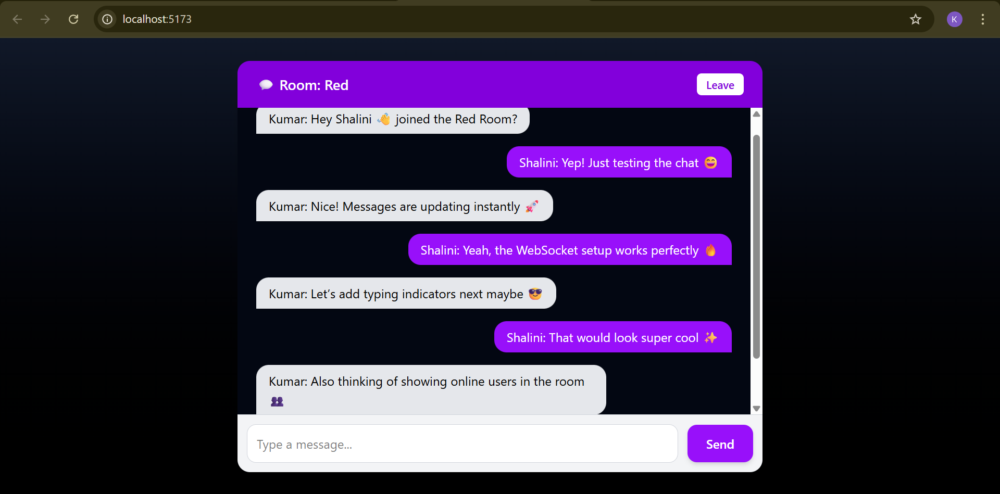

# 💬 ChatApp (WebSocket + React + Node.js + TypeScript)

Real-time room-based chat application built with **React**, **Node.js**, and **WebSocket** — enabling seamless live conversations between multiple users in different rooms.

---

## 🚀 Features

- 🔴 Real-time messaging powered by WebSocket  
- 🏠 Room-based chat system  
- ⚡ Instant message broadcast across users  
- 💻 Simple, clean React-based UI  
- 📱 Responsive design  

---

## 🧩 Tech Stack

| Layer | Technology |
|-------|-------------|
| Frontend | React, Tailwind CSS |
| Backend | Node.js, WebSocket, TypeScript | 
| Communication | Socket-based real-time messaging |
| Styling | Tailwind CSS |

---

## 🖼️ Screenshots

### 🧍 Join Screen
Before and after joining a room

### 💬 Chat Interface
Real-time chat between users in a room

> Real-time messages displayed in the selected chat room.

> User sending a new message — instantly broadcasted to all participants.

---

## 🧠 Example Conversation

